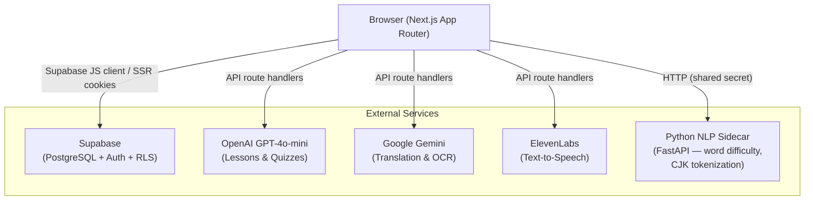
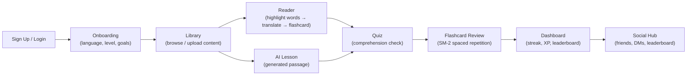

# iLiterate

**Live demo: [iliterate.org](https://iliterate.org)**

A language learning platform that combines contextual reading with AI-powered spaced repetition flashcards. Users read authentic content in their target language, instantly look up unfamiliar words, and convert them into flashcards for later review — all in one place.

---

## Table of Contents

1. [Architecture Overview](#architecture-overview)
2. [Tech Stack](#tech-stack)
3. [Installation & Setup](#installation--setup)
4. [Usage Example](#usage-example)
5. [Repository Structure](#repository-structure)
6. [Team Contributions](#team-contributions)
7. [Retrospective](#retrospective)
8. [License](#license)

---

## Architecture Overview

### System Architecture



### User Flow



---

## Tech Stack

| Layer | Technology |
|---|---|
| **Frontend** | Next.js 16 (App Router), React 19, TypeScript |
| **Styling** | Tailwind CSS 4, shadcn/ui (Radix UI primitives), CVA |
| **Backend / DB** | Supabase (PostgreSQL, Auth, Row Level Security) |
| **AI — Lessons & Quizzes** | OpenAI GPT-4o-mini |
| **AI — Translation & OCR** | Google Gemini API |
| **Text-to-Speech** | ElevenLabs API (multilingual voices) |
| **NLP Sidecar** | Python + FastAPI, `wordfreq`, `lindera` (CJK tokenizer) |
| **Forms** | React Hook Form + Zod |
| **Testing** | Vitest, React Testing Library, jsdom |
| **Mutation Testing** | Stryker Mutator (vitest runner) |
| **API Docs** | TypeDoc |

---

## Installation & Setup

### Prerequisites

- Node.js ≥ 18
- npm ≥ 9
- Python ≥ 3.11 (only needed for the NLP sidecar)
- A [Supabase](https://supabase.com) project
- API keys for OpenAI, Google AI (Gemini), and ElevenLabs

### 1. Clone the repository

```bash
git clone https://github.com/Hrishnugg/CSDS393Project.git
cd CSDS393Project
```

### 2. Install JavaScript dependencies

```bash
cd iliterate
npm install
```

### 3. Configure environment variables

Create `iliterate/.env.local` based on the template below:

```env
# Supabase
NEXT_PUBLIC_SUPABASE_URL=https://<your-project>.supabase.co
NEXT_PUBLIC_SUPABASE_ANON_KEY=<anon-key>
SUPABASE_SERVICE_ROLE_KEY=<service-role-key>

# AI Services
OPENAI_API_KEY=<key>
GOOGLE_AI_API_KEY=<key>

# Text-to-Speech (ElevenLabs)
ELEVENLABS_API_KEY=<key>
ELEVENLABS_VOICE_ID_DEFAULT=<voice-id>

# Python NLP Sidecar (optional in development)
PYTHON_API_BASE_URL=http://localhost:8000
PYTHON_API_SHARED_SECRET=<any-secret-string>
```

### 4. Apply database migrations

Using the Supabase CLI:

```bash
cd iliterate
npx supabase db push
```

Or apply the SQL files in `iliterate/supabase/migrations/` manually in the Supabase dashboard (SQL editor) in numbered order (001 → 015).

### 5. Start the development server

```bash
cd iliterate
npm run dev
```

The app is available at `http://localhost:3000`.

### 6. (Optional) Start the Python NLP sidecar

Word difficulty scoring and CJK tokenization require the Python sidecar:

```bash
cd iliterate/python-api
pip install -r requirements.txt
uvicorn main:app --reload
```

The sidecar runs on `http://localhost:8000`.

---

## Usage Example

1. **Sign up** at `http://localhost:3000/signup` and complete the onboarding questionnaire (native language, target language, proficiency, goals).

2. **Browse the Library** — view AI-generated lessons tailored to your level, or upload your own content (PDF, EPUB, or paste a URL).

3. **Read** — open any article in the Reader. Click or tap any word to see its translation, pronunciation, and definition in a popover.

4. **Save words** — click "Add flashcard" in the translation popover to save a word to your deck.

5. **Review flashcards** — go to the Flashcards section. Rate each card (Again / Hard / Good / Easy); the SM-2 algorithm schedules the next review automatically.

6. **Take quizzes** — after reading, click "Take Quiz" to answer AI-generated comprehension questions and earn XP.

7. **Track progress** — the Dashboard shows your current streak, XP level, and position on the weekly/monthly leaderboard.

---

## Repository Structure

```
CSDS393Project/
├── docs/                        # TypeDoc-generated HTML API documentation
├── iliterate/                   # Main Next.js application
│   ├── python-api/              # FastAPI NLP sidecar (word difficulty, CJK tokenization)
│   ├── scripts/                 # Background workers (uploads, karaoke processing)
│   ├── supabase/
│   │   └── migrations/          # Numbered SQL migrations (001–015)
│   ├── src/
│   │   ├── app/
│   │   │   ├── (auth)/          # Login, signup, onboarding routes
│   │   │   ├── (dashboard)/     # Protected routes: reader, flashcards, library, etc.
│   │   │   └── api/             # Next.js API route handlers
│   │   ├── components/
│   │   │   ├── ui/              # shadcn/ui primitives
│   │   │   ├── reader/          # Reader, ArticleRenderer, AudioPlayer, TranslatePopover
│   │   │   ├── flashcards/      # FlashcardCard, Deck, ReviewButtons, FlashcardReview
│   │   │   ├── home/            # Dashboard tiles (HeroTile, StreakTile, LevelTile, …)
│   │   │   ├── quiz/            # QuizContainer, MCQQuestion, FillBlankQuestion
│   │   │   ├── lesson/          # Lesson generation UI
│   │   │   └── social/          # Friends, leaderboard, direct messages
│   │   ├── lib/
│   │   │   ├── spaced-repetition.ts   # SM-2 algorithm
│   │   │   ├── points.ts              # Gamification point calculations
│   │   │   ├── level-system.ts        # XP thresholds + CEFR mapping
│   │   │   ├── lesson-generator.ts    # OpenAI lesson generation
│   │   │   ├── quiz-generator.ts      # OpenAI quiz generation + grading
│   │   │   ├── validations.ts         # Shared Zod schemas
│   │   │   ├── tts/                   # ElevenLabs TTS wrapper + audio cache hook
│   │   │   ├── supabase/              # Browser, SSR, and admin Supabase clients
│   │   │   └── social/                # Friend + DM server helpers
│   │   └── types/                     # TypeScript DB models and domain types
│   ├── typedoc.json             # TypeDoc configuration
│   ├── vitest.config.ts         # Vitest test configuration
│   └── stryker.config.mjs       # Stryker mutation testing configuration
├── README.md
└── testing.md
```

---

## Team Contributions

| Member | Role | Key Contributions |
|---|---|---|
| **Ethan Fang** | Backend & Gamification | Auth routing, SM-2 flashcard review system, points & leaderboard, daily streak tracking, TTS integration, bookmark system, DB migrations (001–009, 015), test infrastructure, spaced repetition & level-system tests |
| **Hrishi Hari** | Frontend & Infrastructure | Reader highlight/translate system, full UI overhaul (bento grid, collapsible sidebar, dark mode), social hub (friends, DMs), study chat, karaoke mode, file upload pipeline, internationalization (i18n), production deployment |
| **Curtis Li** | Flashcards & Testing | Flashcard page routing and UI, EPUB/book upload feature, initial unit test suite, Stryker mutation testing configuration and `MUTATION_SCORES.md` report |
| **Anthony Retelewski** | Landing Page & Auth UX | Landing page (language showcase, blur animations), RSVP speed reader, dark/light mode toggle, password reset + magic-link flow, i18n + avatar upload, study chat UI improvements |

---

## Retrospective

**What went well:**
- Integrating multiple AI services (OpenAI, Gemini, ElevenLabs) through a clean API-route layer kept the frontend simple and secrets server-side.
- Supabase's Row Level Security made it straightforward to enforce user data isolation without custom middleware.
- The SM-2 spaced repetition algorithm translated directly into a small, well-tested module with no external dependencies.

**What we would do differently:**
- We underestimated the complexity of CJK language support (Japanese/Chinese segmentation). We eventually added a Python NLP sidecar for this, but it introduced deployment complexity. We would architect the NLP layer earlier and containerize it from the start.
- Environment variable management across three services (Next.js, Python sidecar, Supabase CLI) caused friction when onboarding new team members. A single `.env.example` checked into the repo from day one would have helped.
- We added comprehensive tests late in the project. Writing tests alongside features would have caught regressions earlier and made the Stryker mutation testing results more actionable.

**Lessons learned:**
- Designing the database schema and RLS policies upfront saved significant rework — the 15 sequential migrations stayed mostly additive.
- Splitting the team by feature (reader, flashcards, social) worked well until shared components (sidebar, theme) needed simultaneous changes; clearer ownership of shared components would reduce merge conflicts.
- TypeDoc generation is fast and low-maintenance when modules have consistent JSDoc from the start.

---

## License

MIT License — see [LICENSE](LICENSE) for details.

```
MIT License

Copyright (c) 2026 iLiterate Team (CWRU CSDS 393 Group 12)

Permission is hereby granted, free of charge, to any person obtaining a copy
of this software and associated documentation files (the "Software"), to deal
in the Software without restriction, including without limitation the rights
to use, copy, modify, merge, publish, distribute, sublicense, and/or sell
copies of the Software, and to permit persons to whom the Software is
furnished to do so, subject to the following conditions:

The above copyright notice and this permission notice shall be included in all
copies or substantial portions of the Software.

THE SOFTWARE IS PROVIDED "AS IS", WITHOUT WARRANTY OF ANY KIND, EXPRESS OR
IMPLIED, INCLUDING BUT NOT LIMITED TO THE WARRANTIES OF MERCHANTABILITY,
FITNESS FOR A PARTICULAR PURPOSE AND NONINFRINGEMENT. IN NO EVENT SHALL THE
AUTHORS OR COPYRIGHT HOLDERS BE LIABLE FOR ANY CLAIM, DAMAGES OR OTHER
LIABILITY, WHETHER IN AN ACTION OF CONTRACT, TORT OR OTHERWISE, ARISING FROM,
OUT OF OR IN CONNECTION WITH THE SOFTWARE OR THE USE OR OTHER DEALINGS IN THE
SOFTWARE.
```
